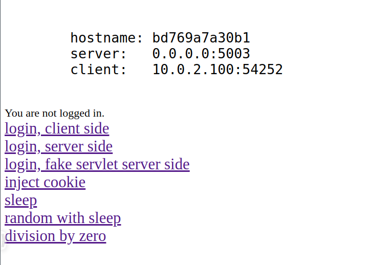
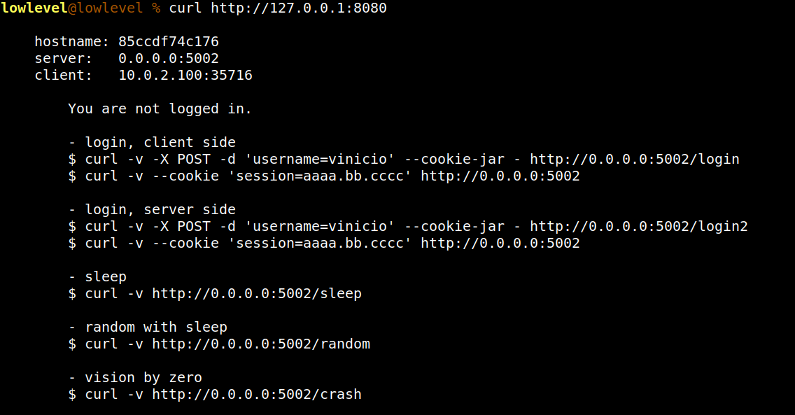

### MicroServicio para el estudio de
~~~
	- proxy.
	- proxy inverso.
	- balanceador de carga.
	- persistencia de sesiones.
    - cache
~~~

#### Levantar 3 réplicas con podman
~~~bash
$ podman run -d --rm -it -p 5001:5001 lowlevel1989/miniserver --port 5001
$ podman run -d --rm -it -p 5002:5002 lowlevel1989/miniserver --port 5002
$ podman run -d --rm -it -p 5003:5003 lowlevel1989/miniserver --port 5003
~~~

#### Levantar 3 réplicas con docker
~~~bash
$ docker run -d --rm -it -p 5001:5001 lowlevel1989/miniserver --port 5001
$ docker run -d --rm -it -p 5002:5002 lowlevel1989/miniserver --port 5002
$ docker run -d --rm -it -p 5003:5003 lowlevel1989/miniserver --port 5003
~~~

#### Desde el navegaro web
 

#### Desde curl
 
